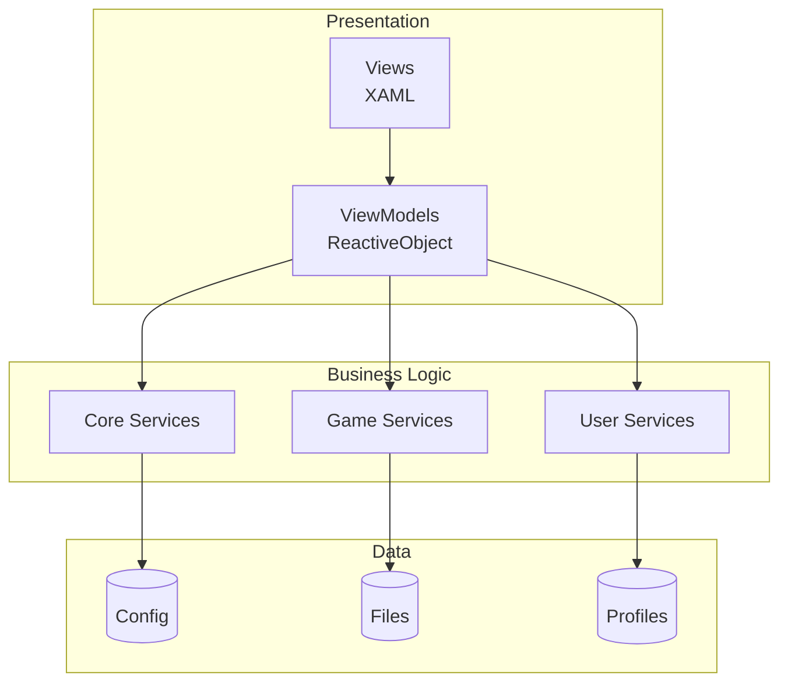

# Introduction to HyPrism

**HyPrism** — a high-performance cross-platform game launcher designed to provide seamless connection between users and the game client. Built on cutting-edge .NET ecosystem technologies — using .NET 10 and Avalonia UI for a native, responsive, and aesthetically pleasing experience on Windows, Linux, and macOS.

Unlike traditional Electron launchers that consume significant RAM and CPU resources, HyPrism compiles to native code, ensuring minimal footprint and maximum performance.

> 🔄 **Migration:** The project recently migrated from Photino (WebKit) to **Avalonia UI**. Details in [MigrationGuide.md](../Technical/MigrationGuide.md).

---

## 🎯 Project Philosophy

- **Performance First:** Every subsystem, from UI rendering to file patching algorithms, is optimized for speed and low latency
- **True Cross-Platform:** Single codebase compiles and runs natively on all major desktop OSes without emulation
- **Security and Integrity:** Advanced hash algorithms (`SHA-256`, `MD5`) guarantee authenticity and immutability of game files
- **Extensibility:** Modular architecture allows easy addition of new services, authentication providers, and UI components

---

## 🛠️ Technology Stack

| Component | Technology | Version | Description |
|-----------|------------|---------|-------------|
| **Runtime** | .NET | 10.0 | Latest runtime for maximum performance |
| **Language** | C# | 13.0 | Using latest language features |
| **UI Framework** | Avalonia UI | 11.3.11 | Declarative XAML-based UI framework |
| **Architecture** | MVVM | - | Model-View-ViewModel for separation of concerns |
| **Reactivity** | ReactiveUI | 11.3.9 | Functional reactive programming |
| **Graphics** | SkiaSharp | 3.116.1 | Hardware-accelerated 2D graphics |
| **SVG** | Avalonia.Svg.Skia | - | High-quality SVG rendering |
| **Logging** | Serilog | 4.3.0 | Structured logging |
| **JSON** | Newtonsoft.Json | 13.0.3 | JSON serialization |
| **DI** | M.E.DependencyInjection | 10.0.2 | Dependency Injection container |

---

## 📦 Key Features

### 🎮 Game Management
- **Binary Patching** — patching game executables in memory or on disk
- **Differential Updates** — Butler for efficient updates
- **Multi-Versions** — support for multiple game versions

### 👤 Profiles
- Multiple independent profiles
- Custom skins
- Isolated settings

### 🔧 Mods
- Mod manager
- CurseForge integration
- Automatic dependency resolution

### 🌍 Localization
- 12+ languages
- Reactive switching
- JSON-based format

### 🎨 Customization
- Theme system
- Customizable accent color
- Custom backgrounds

### 🔗 Integrations
- **Discord Rich Presence** — game status display
- **News Feeds** — Hytale.com integration
- **Asset Management** — intelligent caching and loading

---

## 🏗️ Architecture Overview



For details, see [Architecture.md](../Technical/Architecture.md).

---

## 🚀 Quick Start

```bash
# Clone
git clone https://github.com/yyyumeniku/HyPrism.git
cd HyPrism

# Build and run
dotnet build
dotnet run
```

---

## 📖 Documentation Navigation

| Section | Description |
|---------|-------------|
| **[Features](Features.md)** | Detailed feature description |
| **[Architecture](../Technical/Architecture.md)** | System architecture |
| **[Migration Guide](../Technical/MigrationGuide.md)** | Photino → Avalonia migration |
| **[Services Reference](../Technical/ServicesReference.md)** | Services reference |
| **[UI Component Guide](../Development/UIComponentGuide.md)** | Creating components |
| **[MVVM Patterns](../Development/MVVMPatterns.md)** | MVVM patterns |
| **[Coding Standards](../Development/CodingStandards.md)** | Coding standards |
