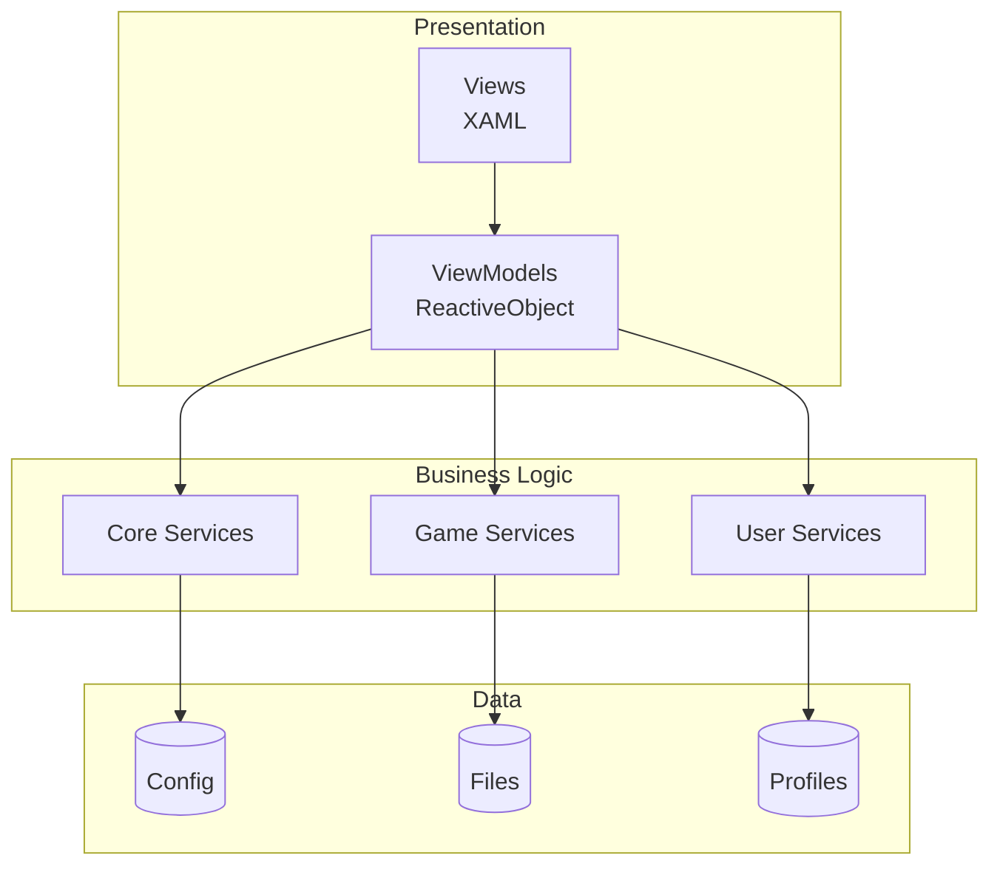

# Введение в HyPrism

**HyPrism** — высокопроизводительный кросс-платформенный игровой лаунчер, разработанный для обеспечения бесшовной связи между пользователем и игровым клиентом. Построен на передовых технологиях экосистемы .NET — использует .NET 10 и Avalonia UI для нативного, отзывчивого и эстетически приятного опыта на Windows, Linux и macOS.

В отличие от традиционных Electron-лаунчеров, потребляющих значительные ресурсы RAM и CPU, HyPrism компилируется в нативный код, обеспечивая минимальный footprint и максимальную производительность.

> 🔄 **Миграция:** Проект недавно мигрировал с Photino (WebKit) на **Avalonia UI**. Подробности в [MigrationGuide.md](../Technical/MigrationGuide.md).

---

## 🎯 Философия проекта

- **Performance First:** Каждая подсистема, от рендеринга UI до алгоритмов патчинга файлов, оптимизирована для скорости и низкой латентности
- **Истинная кросс-платформенность:** Единая кодовая база компилируется и работает нативно на всех основных десктопных ОС без эмуляции
- **Безопасность и целостность:** Продвинутые хэш-алгоритмы (`SHA-256`, `MD5`) гарантируют аутентичность и неизменность игровых файлов
- **Расширяемость:** Модульная архитектура позволяет легко добавлять новые сервисы, провайдеры аутентификации и UI компоненты

---

## 🛠️ Технологический стек

| Компонент | Технология | Версия | Описание |
|-----------|------------|--------|----------|
| **Runtime** | .NET | 10.0 | Новейший runtime для максимальной производительности |
| **Язык** | C# | 13.0 | Использование последних языковых возможностей |
| **UI Framework** | Avalonia UI | 11.3.11 | Декларативный XAML-based UI фреймворк |
| **Архитектура** | MVVM | - | Model-View-ViewModel для разделения ответственности |
| **Реактивность** | ReactiveUI | 11.3.9 | Функциональное реактивное программирование |
| **Графика** | SkiaSharp | 3.116.1 | Аппаратно-ускоренная 2D графика |
| **SVG** | Avalonia.Svg.Skia | - | Высококачественный рендеринг SVG |
| **Логирование** | Serilog | 4.3.0 | Структурированное логирование |
| **JSON** | Newtonsoft.Json | 13.0.3 | JSON сериализация |
| **DI** | M.E.DependencyInjection | 10.0.2 | Dependency Injection контейнер |

---

## 📦 Ключевые возможности

### 🎮 Управление игрой
- **Бинарный патчинг** — патчинг исполняемых файлов игры в памяти или на диске
- **Дифференциальные обновления** — Butler для эффективного обновления
- **Мульти-версии** — поддержка нескольких версий игры

### 👤 Профили
- Несколько независимых профилей
- Кастомные скины
- Изолированные настройки

### 🔧 Моды
- Менеджер модов
- Интеграция с CurseForge
- Автоматическое разрешение зависимостей

### 🌍 Локализация
- 12+ языков
- Реактивное переключение
- JSON-based формат

### 🎨 Кастомизация
- Система тем
- Настраиваемый акцентный цвет
- Кастомные фоны

### 🔗 Интеграции
- **Discord Rich Presence** — отображение статуса игры
- **Ленты новостей** — интеграция с Hytale.com
- **Управление ассетами** — интеллигентное кэширование и загрузка

---

## 🏗️ Архитектурный обзор



Подробнее см. [Architecture.md](../Technical/Architecture.md).

---

## 🚀 Быстрый старт

```bash
# Клонирование
git clone https://github.com/yyyumeniku/HyPrism.git
cd HyPrism

# Сборка и запуск
dotnet build
dotnet run
```

---

## 📖 Навигация по документации

| Раздел | Описание |
|--------|----------|
| **[Features](Features.md)** | Подробное описание функций |
| **[Architecture](../Technical/Architecture.md)** | Архитектура системы |
| **[Migration Guide](../Technical/MigrationGuide.md)** | Миграция Photino → Avalonia |
| **[Services Reference](../Technical/ServicesReference.md)** | Справочник сервисов |
| **[UI Component Guide](../Development/UIComponentGuide.md)** | Создание компонентов |
| **[MVVM Patterns](../Development/MVVMPatterns.md)** | Паттерны MVVM |
| **[Coding Standards](../Development/CodingStandards.md)** | Стандарты кодирования |
